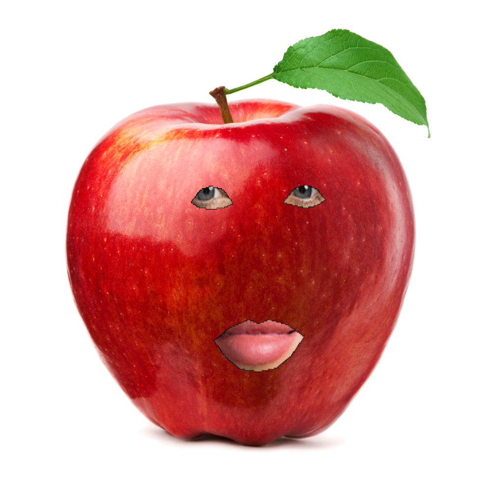
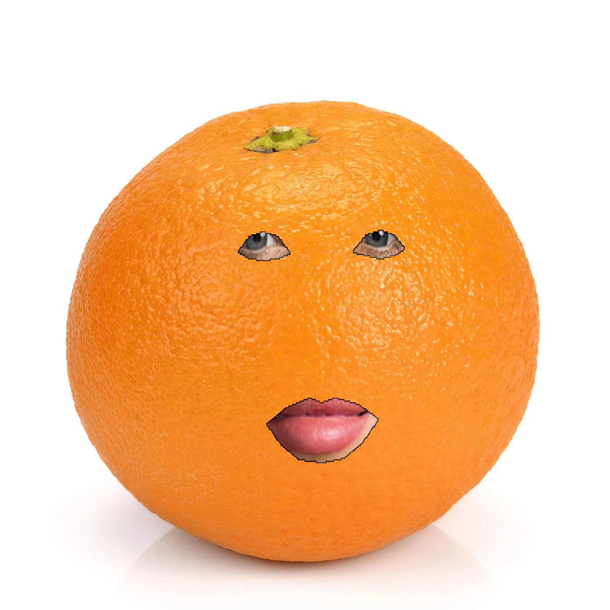
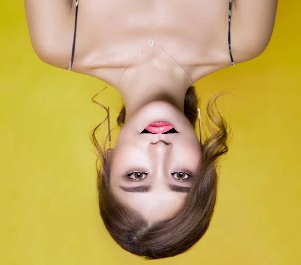
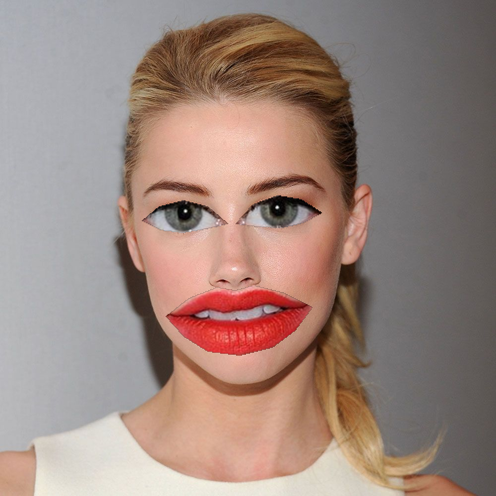

# Run the  ``` main.py ```  file in any folder

<br/>

### [🔗1_Snapchat_Filter](https://github.com/negarslh/image_processing/tree/main/Assignment_30/1_Snapchat_Filter)

<br/>
<hr/>
<br/>

- <B>input


<br/>

- <B>output




<br/>

### [🔗2_Rotate_Photo](https://github.com/negarslh/image_processing/tree/main/Assignment_30/2_Rotate_Photo)

<br/>
<hr/>
<br/>

- <B>input


<br/>

- <B>output



<br/>

### [🔗3_Align_Face](https://github.com/negarslh/image_processing/tree/main/Assignment_30/3_Align_Face)

<br/>
<hr/>
<br/>

- <B>input


<br/>

- <B>output


<br/>

### [🔗4_Big_Eyes_And_Lips](https://github.com/negarslh/image_processing/tree/main/Assignment_30/4_Big_Eyes_And_Lips)

<br/>
<hr/>
<br/>

- <B>input


<br/>

- <B>output


