# Run the  ``` main.py ```  file in any folder

<br/>

### [🔗1_Histogram](https://github.com/negarslh/image_processing/tree/main/Assignment_31/1_Histogram)

<br/>
<hr/>
<br/>

- <B>input


<br/>

- <B>output

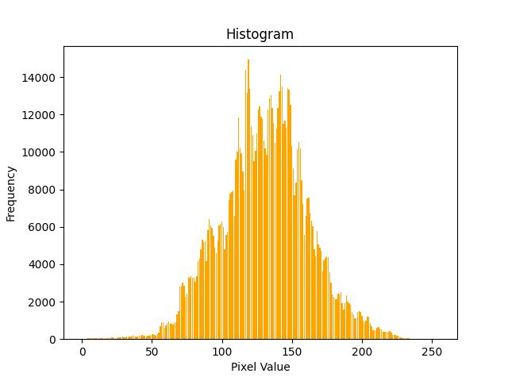
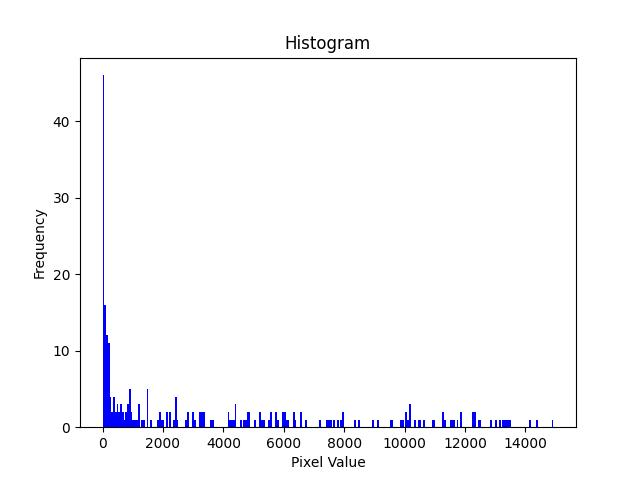
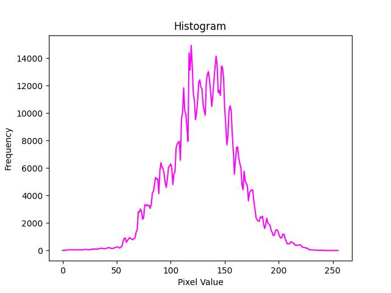

<br/>

### [🔗2_Foreground_focus_(Blur)](https://github.com/negarslh/image_processing/tree/main/Assignment_31/2_Foreground_focus_(Blur))

<br/>
<hr/>
<br/>

- <B>input

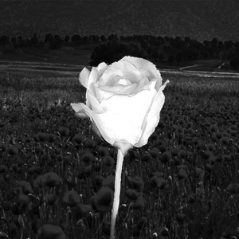

<br/>

- <B>output

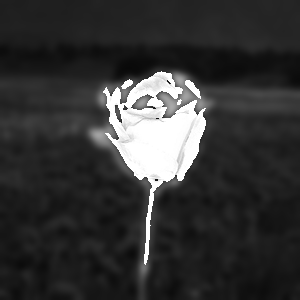

<br/>

### [🔗3_Edge_detection](https://github.com/negarslh/image_processing/tree/main/Assignment_31/3_Edge_detection)

<br/>
<hr/>
<br/>

- <B>input

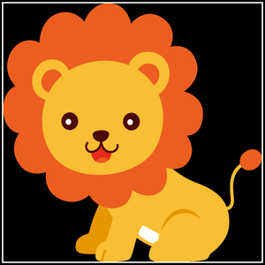

<br/>

- <B>output

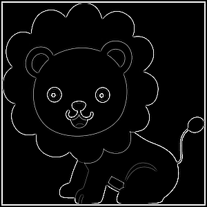

<br/>

### [🔗4_Vertical_and_horizontal_edge_detection](https://github.com/negarslh/image_processing/tree/main/Assignment_31/4_Vertical_and_horizontal_edge_detection)

<br/>
<hr/>
<br/>

- <B>input

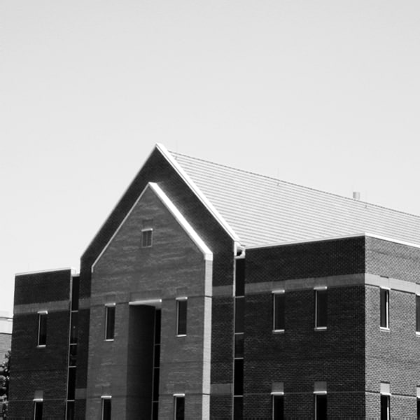

<br/>

- <B>output

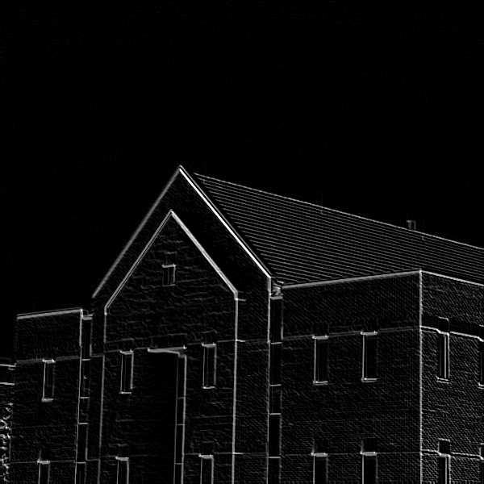
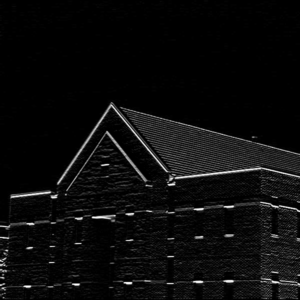
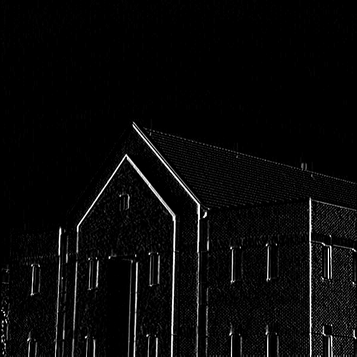

<br/>

### [🔗5_Noise_reduction](https://github.com/negarslh/image_processing/tree/main/Assignment_31/5_Noise_reduction)

<br/>
<hr/>
<br/>

- <B>input

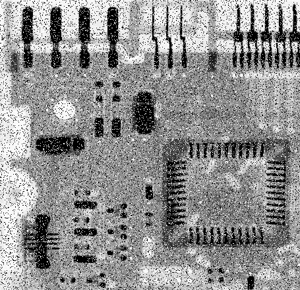
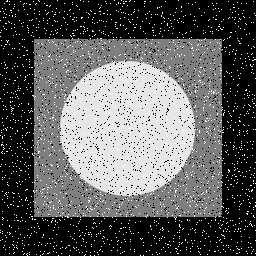


<br/>

- <B>output


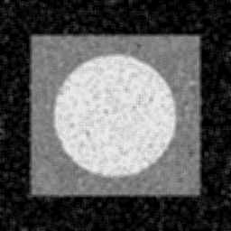
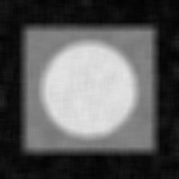

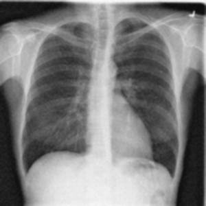
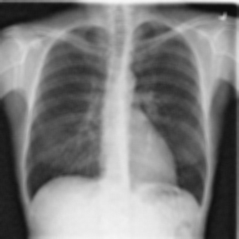
