# Run the  ``` main.py ```  file in any folder

<br/>

### [🔗1_Convolution_2D](https://github.com/negarslh/image_processing/tree/main/Assignment_32/1_Convolution_2D)

<br/>
<hr/>
<br/>

- <B>input


<br/>

- <B>output

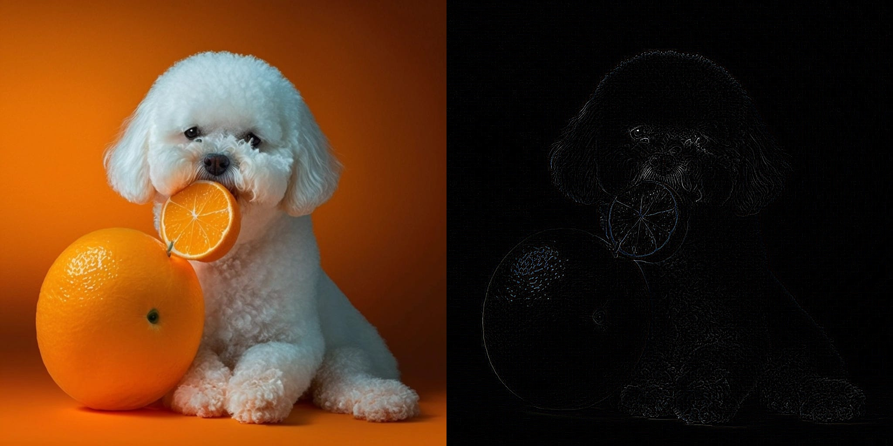
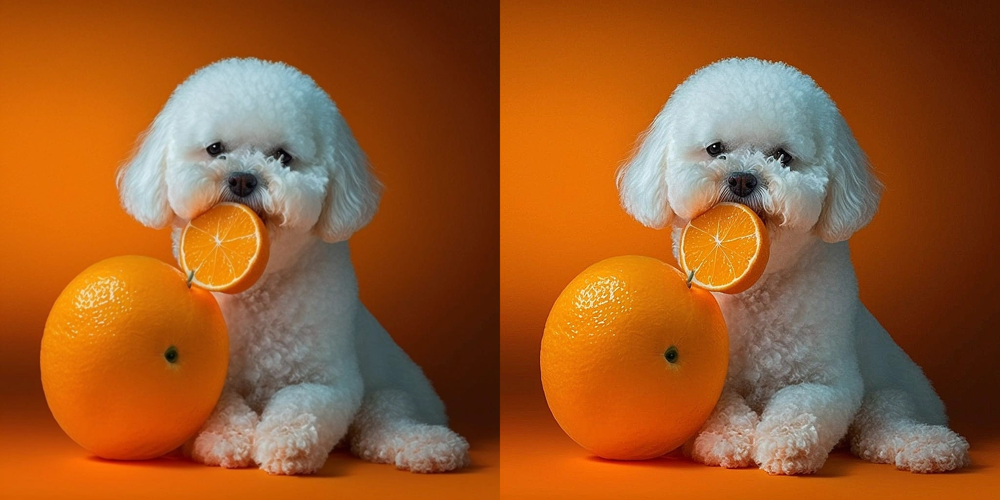
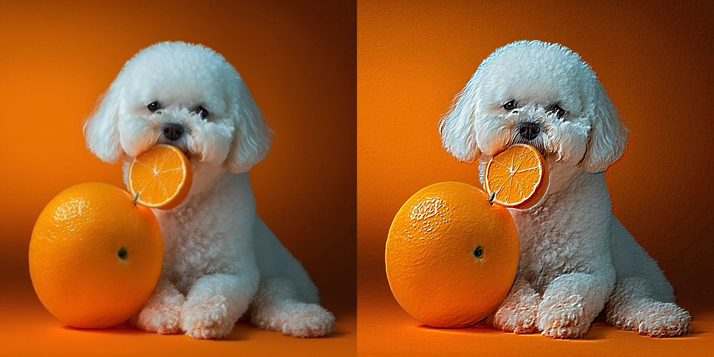
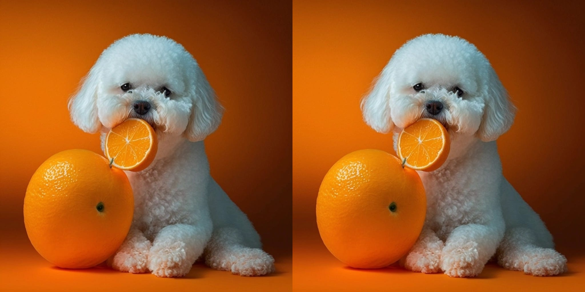
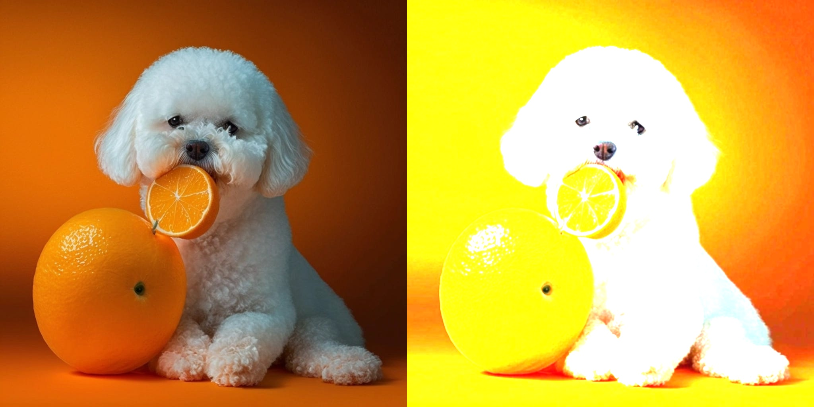

<br/>

### [🔗2_Average_filter_to_reveal_hidden](https://github.com/negarslh/image_processing/tree/main/Assignment_32/2_Average_filter_to_reveal_hidden)

<br/>
<hr/>
<br/>

- <B>input


<br/>

- <B>output


<br/>

### [🔗3_Median_filter_to_reduce_noise](https://github.com/negarslh/image_processing/tree/main/Assignment_32/3_Median_filter_to_reduce_noise)

<br/>
<hr/>
<br/>

- <B>input


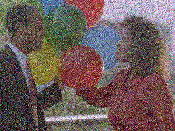


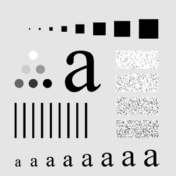


<br/>

- <B>output

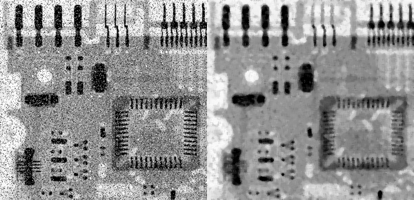
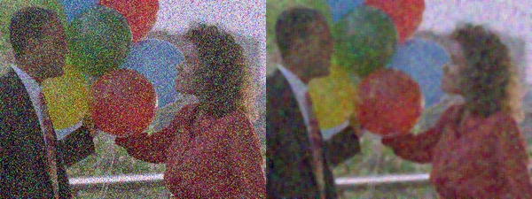
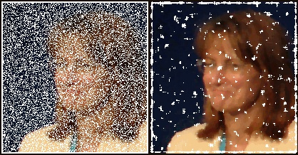
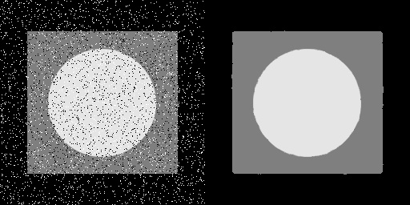
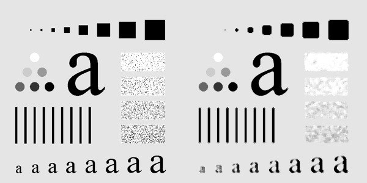
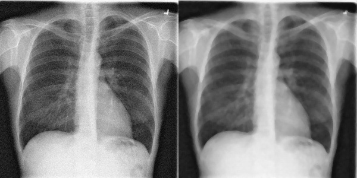


<br/>

### [🔗4_Histogram_Equalization](https://github.com/negarslh/image_processing/tree/main/Assignment_32/4_Histogram_Equalization)

<br/>
<hr/>
<br/>

- <B>input

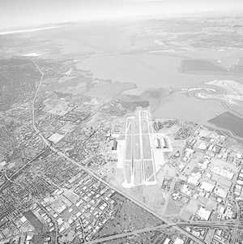
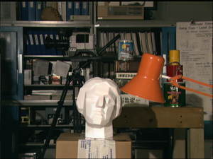
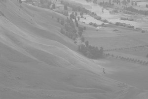

<br/>

- <B>output 1: Histogram Equalization


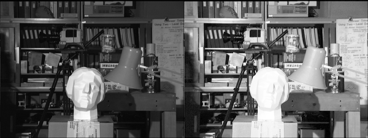
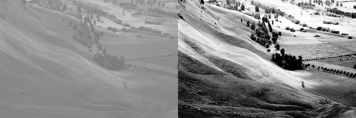

<br/>

- <B>output 2: CLAHE

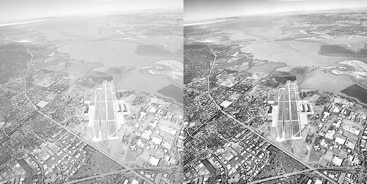
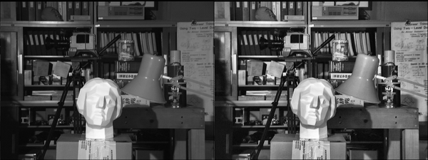
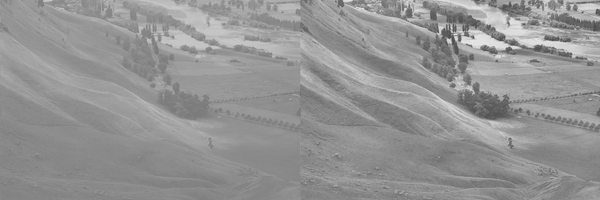
